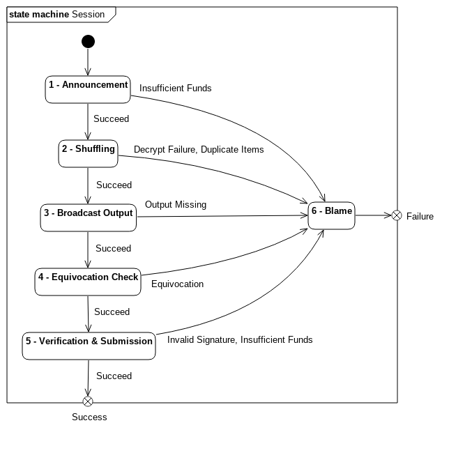

Protocol
========

CashShuffle_ is an extension to CoinShuffle_. The CoinShuffle protocol defines
a sequence of 5 phases (+ a 6th blame phase for identifying protocol
violators). Several details are left implementation defined.

.. _CashShuffle: https://cashshuffle.com/
.. _CoinShuffle: http://crypsys.mmci.uni-saarland.de/projects/CoinShuffle/

.. toctree::
   protocol/configuration
   protocol/message
   protocol/type

